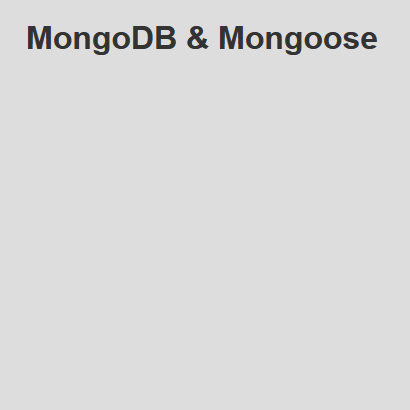

# FreeCodeCamp - Backend Challenges - MongoDB and Mongoose

This is a solution to the [MongoDB and Mongoose](https://www.freecodecamp.org/learn/back-end-development-and-apis/mongodb-and-mongoose/) course on [FreeCodeCamp](https://www.freecodecamp.org/).

## Table of contents

- [Overview](#overview)
  - [The challenge](#the-challenge)
  - [Screenshot](#screenshot)
  - [Links](#links)
- [My process](#my-process)
  - [Built with](#built-with)
  - [How to install and run](#how-to-install-and-run)
- [Author](#author)
- [License](#license)

## Overview

### The challenge

"In this course, you'll learn the fundamentals of working with persistent data including how to set up a model, and save, delete, and find documents in the database."

### Screenshot



### Links

- Code URL: [Github](https://github.com/cekstedt/FreeCodeCamp-MongoDB)
- Live Site URL: [Glitch](https://enchanting-loud-munchkin.glitch.me/)
- Challenge URL: [FreeCodeCamp](https://www.freecodecamp.org/learn/back-end-development-and-apis/mongodb-and-mongoose/)

## My process

### Built with

- NodeJS
- Express
- MongoDB
- Mongoose

### How to install and run

Make sure you have node.js installed.
```
node -v
```

Clone into the repo.
```
git clone https://github.com/cekstedt/FreeCodeCamp-NPM
```

Navigate into the root project folder and install dependencies.
```
cd FreeCodeCamp-NPM/
npm install
```

Create a `.env` file and add a `MONGO_URI='insert_variable_here'` variable to it. Its value should be your MongoDB database URI, which will take one of the following two forms:

> #### Local MongoDB Cluster
>
> Make sure you have [MongoDB](https://www.mongodb.com/docs/manual/installation/) installed.
> 
> Start a second terminal session, and run the command `mongod`.
> 
> Now set your `MONGO_URI` variable in your `.env` file to `mongodb://localhost:27017/{database-name}`.

**- OR -**

> #### MongoDB Atlas Cluster
> 
> Follow [this tutorial](https://www.freecodecamp.org/news/get-started-with-mongodb-atlas/) to set up a hosted database on MongoDB Atlas if you haven't already.
> 
> Now set your `MONGO_URI` variable in your `.env` file to `mongodb+srv://{username}:{password}@{mongoDB-subdomain}.mongodb.net`.
> 
> To find your actual connection string:
> - Navigate to your [Atlas Account](www.mongodb.com)
> - Select your database cluster
> - Select the "Connect" button
> - Select the "Connect to you application > Drivers" tab
> - This will provide more specific instructions for connecting to your database from your app, including the connection string.

Lastly, run the command `npm run start` to start the server, then navigate to http://localhost:3000/ (when developing locally).

## Author

- FreeCodeCamp - [@cekstedt](https://www.freecodecamp.org/cekstedt)

## License

- FreeCodeCamp material is licensed under the [BSD-3-Clause](https://github.com/freeCodeCamp/freeCodeCamp/blob/main/LICENSE.md) license.
